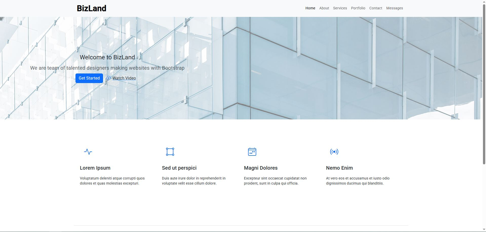
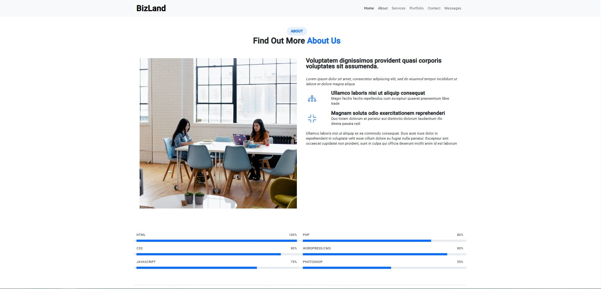
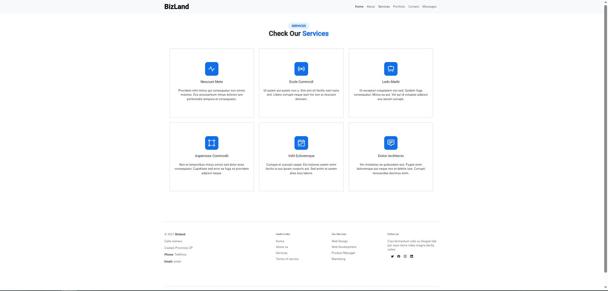
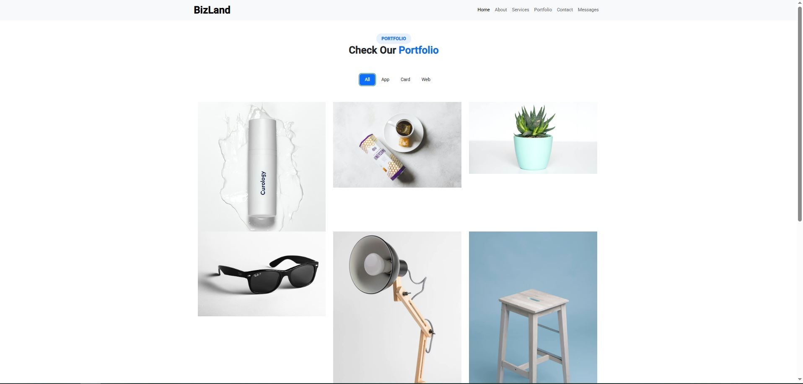
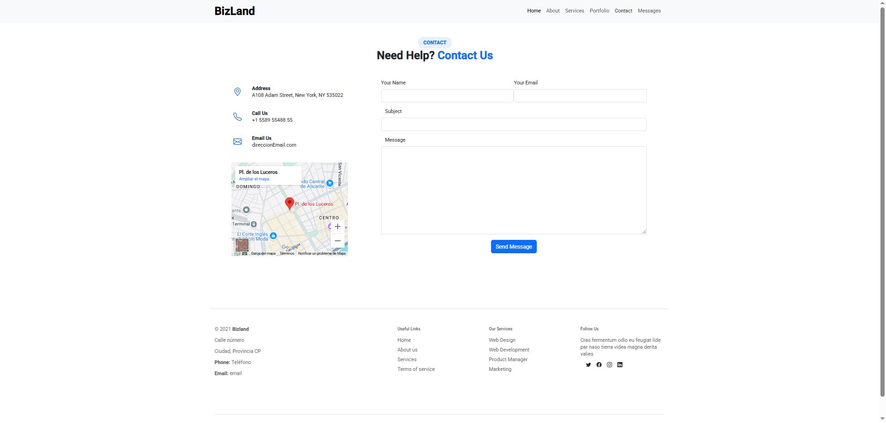
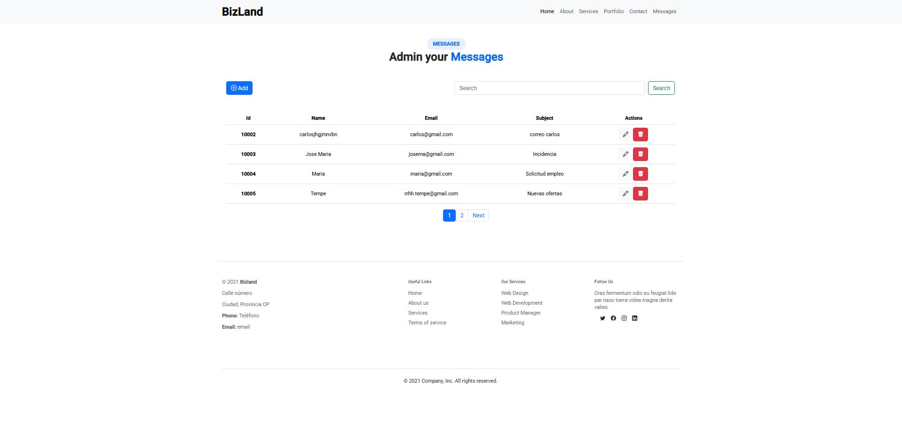
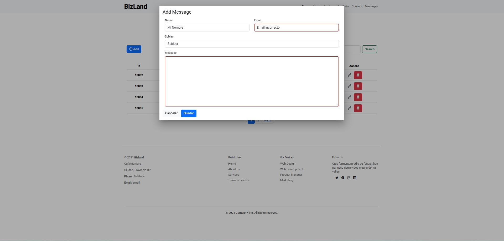
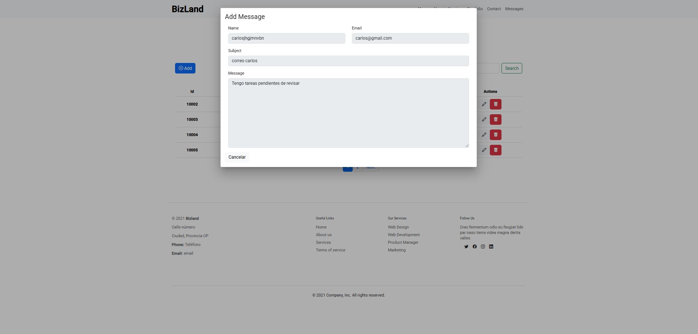
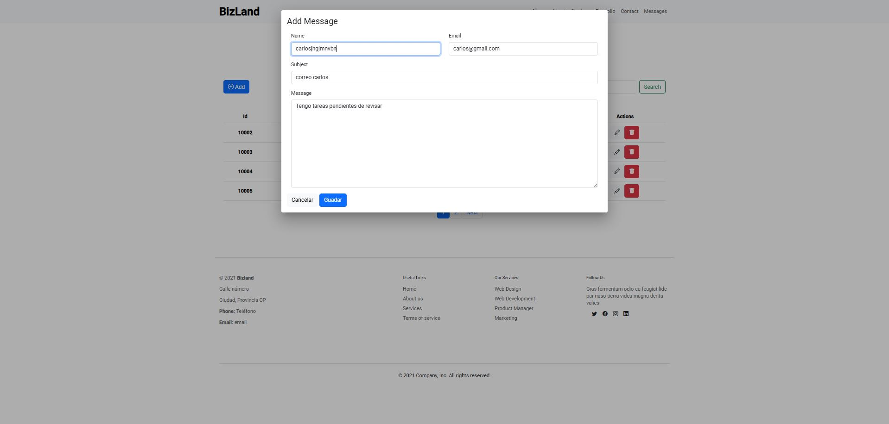

# MiProyectoAngular
This project was developed using Angular, TypeScript, Bootstrap, C#.NET and SQL Server technologies

## Capturas de pantalla

### Home

### About

### Services

### Portfolio

### Contact

### CRUD List

### CRUD Create Reactive Form

### CRUD Read

### CRUD Update

